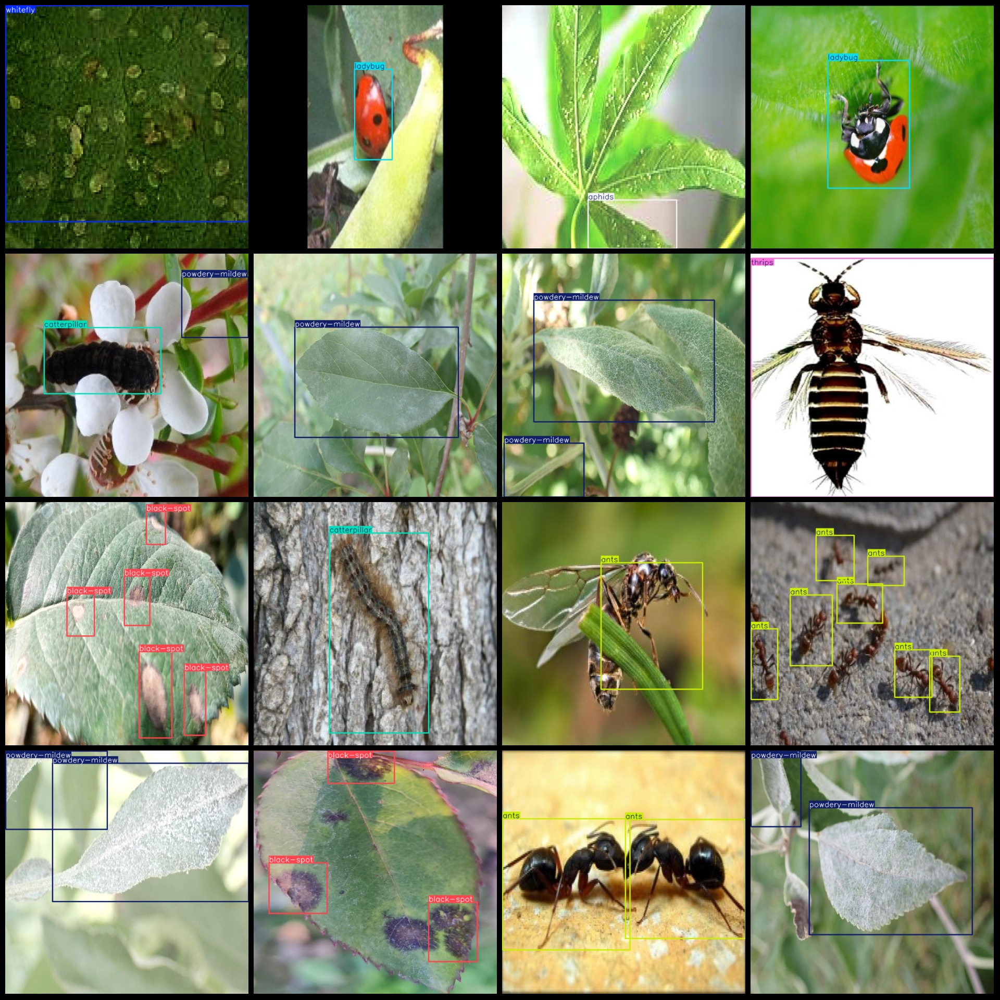
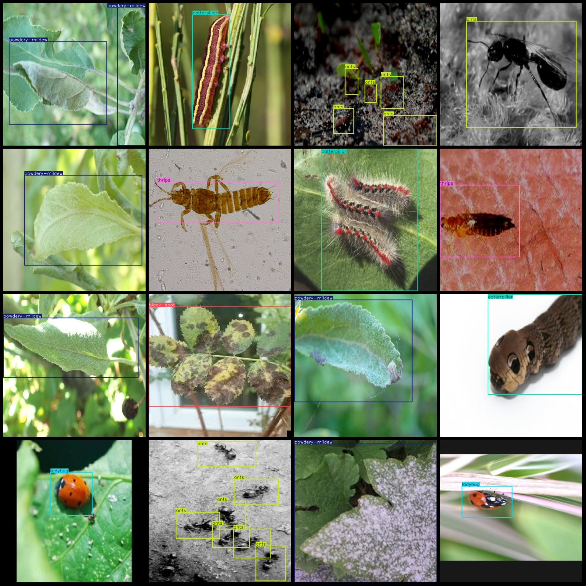

# Agricultural Pest and Disease Detection Dataset VOC+YOLO Format with 2694 Images in 8 Categories

Dataset format: Pascal VOC format+YOLO format (txt file without split paths, only including jpg images and corresponding VOC formatxml files and yolo formattxt files)
number of images: 2694  
annotation count: 2694  
annotation count: 2694  
annotationnumber of classes: 8  
Annotation class names: ["ants", "aphids", "black-spot", "caterpillar", "ladybug", "powdery-mildew", "thrips", "whitefly"]
boxes per class:   
antsbox count = 739
aphidsbox count = 251
black-spotbox count = 1232
catterpillarbox count = 448
ladybugbox count = 495
powdery-mildewbox count = 588
thripsbox count = 474
whiteflybox count = 959
Total frames: 5186
Each category's number of images:
Ants (ant) = 393
Aphids (aphid) = 120
Black-spot (black spot) = 409
Caterpillar (caterpillar) = 334
Ladybug (ladybug) = 415
Powdery-mildew (powdery mildew) = 413
Thrips (thrips) = 387
Whitefly (whitefly) = 299
Image resolution: 640x640
Labeling tool used: labelImg
Annotation rules: Draw a rectangle around the category.
Important note: The dataset does not include a training/validation/test split, which must be done manually.
Special notice: This dataset does not guarantee the accuracy of the trained model or weight files.
Image Preview:
## Images

Here is a pay link on Stripe ( https://buy.stripe.com/3cs8yP7sY87d0vu9AB ). Please contact me lonlonago@foxmail.com after funding $89, and I will send you a complete data files , thank you!

